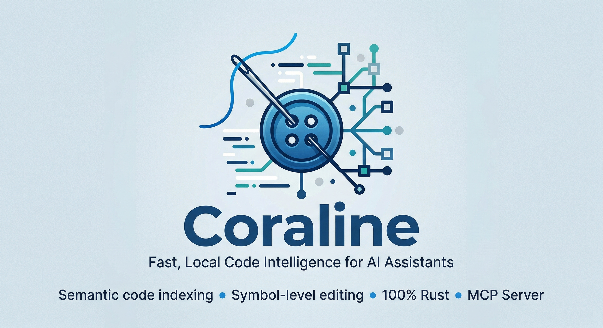

<div align="center">



# Coraline

### Fast, Local Code Intelligence for AI Assistants

**Semantic code indexing • Symbol-level editing • 100% Rust • MCP Server**

[](LICENSE-MIT)
[](https://www.rust-lang.org/)

</div>

---

## What is Coraline?

Coraline is a Rust-based code intelligence system that builds semantic knowledge graphs for AI assistants. It combines ideas from [CodeGraph](https://github.com/colbymchenry/codegraph) and [Serena](https://github.com/oraios/serena) to provide:

- ⚡ **Fast indexing** - Native Rust performance for rapid code analysis
- 🧠 **Semantic search** - Find code by meaning using vector embeddings
- 🔧 **Symbol-level tools** - Precise function/class/method operations
- 🔒 **100% local** - All processing happens on your machine
- 🌐 **MCP integration** - Works with Claude Desktop, Claude Code, and OpenCode

## Installation

```bash
# From crates.io (recommended)
cargo install coraline

# Or download pre-built binaries from releases
# https://github.com/greysquirr3l/coraline/releases
```

## Quick Start

```bash
# Initialize and index a project
cd your-project
coraline init -i

# Optional: Download embedding model and generate vectors for semantic search
coraline embed --download

# Start MCP server for AI assistants
coraline serve --mcp
```

### MCP Configuration

Add to your MCP client config:

**Claude Desktop** (`~/Library/Application Support/Claude/claude_desktop_config.json`):
```json
{
  "mcpServers": {
    "coraline": {
      "command": "/path/to/coraline",
      "args": ["serve", "--mcp"]
    }
  }
}
```

**Claude Code** (`.claude/mcp.json` in workspace):
```json
{
  "mcpServers": {
    "coraline": {
      "command": "coraline",
      "args": ["serve", "--mcp"]
    }
  }
}
```

**OpenCode** (`.opencode/config.json` in workspace):
```json
{
  "mcpServers": {
    "coraline": {
      "command": "coraline",
      "args": ["serve", "--mcp", "--timeout", "300000"]
    }
  }
}
```

## CLI Commands

```bash
coraline init [path]                      # Initialize project
coraline index [path]                     # Build code graph
coraline sync [path]                      # Incremental update
coraline status [path]                    # Show project status
coraline query <search>                   # Search symbols
coraline serve --mcp [--timeout <ms>]     # Start MCP server
coraline embed [--download]               # Generate semantic embeddings
coraline hooks install                    # Auto-sync on git commits
```

## MCP Tools

Coraline exposes 33 tools for code intelligence:

**Core Tools**: `coraline_search`, `coraline_callers`, `coraline_callees`, `coraline_impact`, `coraline_context`, `coraline_semantic_search`

**Batch Tools**: `coraline_batch_get_nodes`, `coraline_batch_callers`, `coraline_batch_callees` (60-90% token savings)

**Advanced Search**: `coraline_search_by_signature`, `coraline_search_by_docstring`, `coraline_search_exported_symbols`

**All tools support** `output_format: "compact"` for 65% token reduction.

## Documentation

📖 **[Read the full documentation →](https://greysquirr3l.github.io/coraline/)**

- [Installation & Setup](https://greysquirr3l.github.io/coraline/installation.html)
- [MCP Tools Reference](https://greysquirr3l.github.io/coraline/mcp-tools.html)
- [CLI Reference](https://greysquirr3l.github.io/coraline/cli-reference.html)
- [Configuration Guide](https://greysquirr3l.github.io/coraline/configuration.html)
- [OpenCode Integration](https://greysquirr3l.github.io/coraline/opencode.html)
- [Architecture](https://greysquirr3l.github.io/coraline/architecture.html)

## Supported Languages

33 languages including TypeScript, Rust, Python, Go, C#, Java, C/C++, Ruby, Bash, PHP, Swift, Kotlin, Haskell, Scala, Lua, Markdown, and more.

[See full language support →](https://greysquirr3l.github.io/coraline/languages.html)

## Contributing

Contributions welcome! See [DEVELOPMENT.md](docs/DEVELOPMENT.md) for build setup and contribution guidelines.

## License

Licensed under either of Apache License 2.0 or MIT license at your option.

## Acknowledgements

Built upon ideas from [CodeGraph](https://github.com/colbymchenry/codegraph) by Colby McHenry and [Serena](https://github.com/oraios/serena) by Oraios AI, using [tree-sitter](https://tree-sitter.github.io/) for parsing.

---

<div align="center">

**Built with Rust for the AI coding community**

[Documentation](https://greysquirr3l.github.io/coraline/) · [Report Bug](https://github.com/greysquirr3l/coraline/issues) · [Request Feature](https://github.com/greysquirr3l/coraline/issues)

</div>
