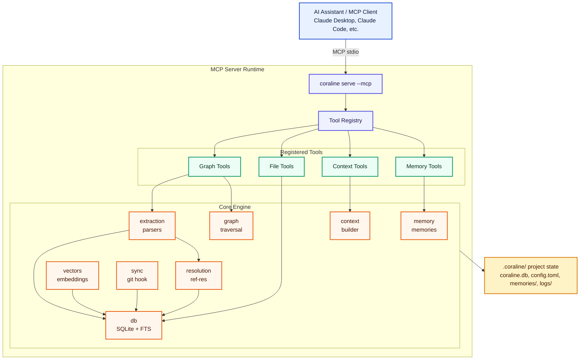

# Coraline Architecture

Coraline is a local-first code intelligence system that builds a semantic knowledge graph from any codebase. It uses tree-sitter for deterministic AST-based parsing, SQLite for storage and full-text search, and exposes its capabilities via both a CLI and an MCP server.

---

## High-Level Overview



---

## Source Layout

```
crates/coraline/src/
├── bin/coraline.rs     # CLI entry point (clap)
├── lib.rs              # Public API surface
├── types.rs            # NodeKind, EdgeKind, all shared types
├── db.rs               # SQLite layer + schema + FTS
├── extraction.rs       # Tree-sitter parsing + indexing pipeline
├── graph.rs            # Graph traversal and subgraph queries
├── resolution/         # Cross-file reference resolution
│   ├── mod.rs          # Core resolver + framework fallback
│   └── frameworks/     # Language/framework-specific resolvers
│       ├── mod.rs      # FrameworkResolver trait + registry
│       ├── rust.rs     # crate::, super::, self:: resolution
│       ├── react.rs    # ./Foo imports, @/ aliases, components
│       ├── blazor.rs   # .razor file discovery, .NET types
│       └── laravel.rs  # PSR-4, blade views, facades
├── context.rs          # Context builder (Markdown/JSON output)
├── vectors.rs          # Vector storage + cosine similarity
├── memory.rs           # Project memory CRUD
├── config.rs           # TOML + JSON configuration loading
├── sync.rs             # Incremental sync + git hook management
├── logging.rs          # Structured logging (tracing)
├── mcp.rs              # MCP server (JSON-RPC over stdio)
├── utils.rs            # Shared utilities
└── tools/
    ├── mod.rs          # Tool trait + ToolRegistry
    ├── graph_tools.rs  # search, callers, callees, impact, find_symbol, ...
    ├── context_tools.rs# coraline_context
    ├── file_tools.rs   # read_file, list_dir, status, config
    └── memory_tools.rs # write/read/list/delete/edit memory
```

---

## Data Model

### Nodes

Every extracted symbol is a `Node`:

```rust
pub struct Node {
    pub id: String,              // SHA-based deterministic ID
    pub kind: NodeKind,          // function, class, method, struct, ...
    pub name: String,            // unqualified symbol name
    pub qualified_name: Option<String>,
    pub file_path: String,       // absolute path
    pub language: String,
    pub start_line: i64,
    pub end_line: i64,
    pub start_column: i64,
    pub end_column: i64,
    pub signature: Option<String>,
    pub docstring: Option<String>,
    pub visibility: Option<String>,
    pub is_exported: bool,
    pub is_async: bool,
    pub is_static: bool,
    pub is_abstract: bool,
    pub decorators: Vec<String>,
    pub type_parameters: Vec<String>,
}
```

**NodeKind values:** `file`, `module`, `class`, `struct`, `interface`, `trait`, `protocol`, `function`, `method`, `property`, `field`, `variable`, `constant`, `enum`, `enum_member`, `type_alias`, `namespace`, `parameter`, `import`, `export`, `route`, `component`

### Edges

Relationships between nodes are `Edge` records:

```rust
pub struct Edge {
    pub id: String,
    pub source: String,          // source node ID
    pub target: String,          // target node ID
    pub kind: EdgeKind,
    pub line: Option<i64>,       // line where the relationship occurs
    pub metadata: Option<String>,
}
```

**EdgeKind values:** `contains`, `calls`, `imports`, `exports`, `extends`, `implements`, `references`, `type_of`, `returns`, `instantiates`

---

## Indexing Pipeline

1. **Scan** — Glob the project tree using `include_patterns`/`exclude_patterns`.
2. **Parse** — For each file, spawn the appropriate tree-sitter grammar and walk the AST.
3. **Extract** — Emit `Node` and `Edge` records from the AST visitor.
4. **Store** — Upsert nodes and edges into SQLite. A file content hash prevents re-parsing unchanged files.
5. **Resolve** — Walk `unresolved` reference edges, attempt name-based resolution in the DB; fall back to framework-specific resolvers for zero-candidate references.

### Incremental Sync

`coraline sync` (and the git post-commit hook) uses `git diff --name-only HEAD~1` to find changed files, then re-parses only those files. Deleted files have their nodes pruned from the graph.

---

## Reference Resolution

Resolution happens in two passes:

1. **Name-based**: The `resolution::resolve_unresolved` function looks up reference names in the DB using ranked candidate scoring (file proximity, name similarity, kind match).

2. **Framework fallback**: When no candidates score above threshold, `framework_fallback` is called. The registered `FrameworkResolver` implementations detect the active framework (by checking for `Cargo.toml`, `package.json`, `artisan`, `.csproj`, etc.) and return candidate file paths. Nodes from those files are then loaded and filtered by the referenced symbol name.

Current framework resolvers:
- **RustResolver** — `crate::`, `super::`, `self::` qualified paths → `.rs` file mapping
- **ReactResolver** — `./Foo` relative imports, `@/` path aliases, PascalCase component search
- **BlazorResolver** — PascalCase component → `.razor` file, dot-qualified .NET types
- **LaravelResolver** — PSR-4 FQN → PHP file, dot-notation views → blade templates

---

## Tool Architecture

All MCP tools implement the `Tool` trait:

```rust
pub trait Tool: Send + Sync {
    fn name(&self) -> &'static str;
    fn description(&self) -> &'static str;
    fn input_schema(&self) -> Value;
    fn execute(&self, params: Value) -> ToolResult;
}
```

Tools are registered in a `ToolRegistry`, which:
- Dispatches `tools/call` MCP requests by name
- Automatically generates `tools/list` responses from registered metadata
- Can be used outside MCP (CLI, library API, tests)

---

## Database Schema

The SQLite database (`.coraline/coraline.db`) has three main tables:

| Table | Purpose |
|---|---|
| `nodes` | All indexed symbols with full metadata |
| `edges` | Directed relationships between nodes |
| `nodes_fts` | FTS5 virtual table for fast name search |

A `files` table tracks content hashes for incremental sync. An `unresolved_refs` table holds references that couldn't be resolved during extraction, to be retried on full resolution passes.

---

## MCP Protocol

The MCP server (`coraline serve --mcp`) communicates over `stdin`/`stdout` using JSON-RPC 2.0, conforming to the [Model Context Protocol specification](https://modelcontextprotocol.io/).

Supported MCP methods:
- `initialize` / `notifications/initialized`
- `tools/list` — returns tool descriptors with cursor pagination (`cursor` / `nextCursor`)
- `tools/call` — dispatches to `ToolRegistry`
- `ping`

The server is single-threaded and synchronous; each request is fully processed before the next is read.

---

## Logging

Structured logs use the `tracing` crate:

- **Console**: stderr at the level set by `CORALINE_LOG` (default: `info`)
- **File**: `.coraline/logs/coraline.log` with daily rotation (kept 7 days)

```bash
CORALINE_LOG=debug coraline index      # verbose
CORALINE_LOG=warn coraline serve --mcp # quiet
```
